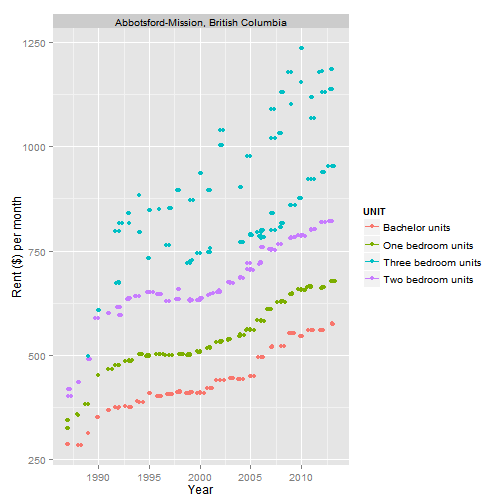

title: LOU-EH?
========================================================
   
***Canadian Rental Apartement Analysis Tool***   
        
  
  
*[loo-ey] combination of the french verb 'loue' (to rent) and the canadian expression 'eh?'**[1]**  
***  
    
author: Ryan Eaton   
date: 2014-08-13   
<p style="position:absolute;bottom:10px;right:10px"> 1 of 5  </p>

========================================================
left:15%


***
**Introduction:**  
Renting an apartment can represent a sizable portion of ones living expenses**[2]**. I have developed a shiny**[3]** application designed to allow users to compare rental costs via a scatterplot for various Canadian cities.  

Additionnaly the application allows predictions to be generated for rental costs in future years. The user can also quickly find city maps via google maps**[4]**.  Links to various social media options are provided to share the application. 

<p style="position:absolute;bottom:10px;right:10px"> 2 of 5  </p>

========================================================
left:15%

***
**Data:** 
- Data was downloaded from the Canadian Open Data website**[5]**. 


```r
d <- read.csv("00270040-eng.csv",fileEncoding="latin1")
dim(d)
```

```
[1] 64112     8
```

- Data contains year, city, apartment type, building type, and location data

- Cities with fewer that 50 data points and rental costs lower than 100$ were removed 


<p style="position:absolute;bottom:10px;right:10px"> 3 of 5  </p>

========================================================
left:15%


***
**Example plot from application:** 


***
 

<p style="position:absolute;bottom:10px;right:10px"> 4 of 5  </p>

========================================================
left:15%


***
**Conclusion:** 

This application could help people in various situations, whether renting their first apartment, or looking at moving to a new. It would also aid when comparing rental living costs for different cities. Further development could include links to apartment rental sites (craigslist, Kijiji etc).   

**References:**  
1.http://en.wikipedia.org/wiki/Eh
2.http://www.ehow.com/about_5096059_much-paycheck-should-spend-rent_.html  
3.http://shiny.rstudio.com/  
4.http://en.wikipedia.org/wiki/Google_Maps  
5.http://data.gc.ca  
<p style="position:absolute;bottom:10px;right:10px"> 5 of 5  </p>
